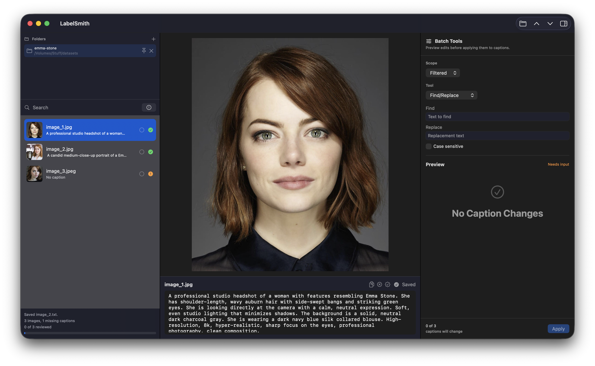

# LabelSmith for macOS

[](https://github.com/atlasnotch/LabelSmith-MacOS/actions/workflows/codeql.yml)

LabelSmith is a native macOS app for quickly reviewing and editing image captions in
Ostris AI Toolkit-style datasets.

Drop in a folder of training images, move through the set with the keyboard, edit the
caption, and let LabelSmith save the matching `.txt` sidecar file for you.



## Features

- Native SwiftUI macOS interface.
- Drag-and-drop folder loading, with an Open Folder command as a fallback.
- Strict Ostris-style dataset support:
  - top-level `.jpg`, `.jpeg`, and `.png` files
  - same-basename `.txt` caption files
- Large image preview with a fast caption editor.
- Thumbnail/sidebar navigation.
- Search across filenames and captions.
- Missing-caption filter and dataset summary.
- Batch caption tools with scoped find/replace, prefix/suffix and trigger-word edits,
  tag normalization, and live preview before saving.
- Review workflow with reviewed/unreviewed state, progress summary, next-missing and
  next-unreviewed navigation, and quick caption actions.
- Persistent workspace with launch restore, recent and pinned folders, per-folder UI
  state, and clear unavailable-folder handling.
- Autosaves caption edits to sidecar `.txt` files.
- Unit-tested scanner, caption persistence, batch edit logic, and workspace state.

## Roadmap / TODOs

- Undo/history/backups:
  - Add per-caption undo for recent edits.
  - Keep a lightweight edit history during the current session.
  - Create optional timestamped backups before bulk operations.
  - Make failed saves and restore paths clear so captions are not silently lost.

- Better image inspection:
  - Add zoom, pan, fit-to-window, and actual-size controls.
  - Show image dimensions, file size, and format metadata.
  - Add keyboard shortcuts for zooming and switching inspection modes.
  - Improve thumbnail and preview behavior for very large datasets.

- Flexible dataset support:
  - Add optional recursive folder scanning.
  - Support additional image formats such as `.webp` where macOS can decode them.
  - Offer dataset profiles, including strict Ostris sidecars and more permissive sidecar modes.
  - Surface ignored files and folders so users understand what was skipped.

- Connect auto-captioning with LMStudio:
  - Add settings for a local LMStudio endpoint and model.
  - Send the selected image, or a batch of missing-caption images, for caption generation.
  - Let users review generated captions before saving them.
  - Track generated captions separately from manually reviewed captions.

- Stats/export:
  - Show caption completion, missing-caption count, review progress, and tag frequency.
  - Highlight duplicate captions, unusually short captions, and unusually long captions.
  - Export dataset summaries to CSV or JSON.
  - Export captions in additional training-friendly formats when useful.

## Dataset Format

LabelSmith currently expects a flat folder:

```text
dataset/
  image001.jpg
  image001.txt
  image002.png
  image002.txt
  image003.jpeg
```

Each `.txt` file contains the caption for the image with the same base name. If a
caption file does not exist yet, LabelSmith creates it when you edit and save that
image's caption.

For now, LabelSmith intentionally ignores subfolders and non-Ostris image extensions
such as `.webp`, `.gif`, and `.tiff`.

## Requirements

- macOS 14 or newer to run the app.
- Xcode 26 or newer for local development.
- Swift 6 toolchain for local development.

## Download and Install

Most users should install LabelSmith from the GitHub Releases page instead of
building it from source:

1. Open the
   [LabelSmith releases page](https://github.com/atlasnotch/LabelSmith-MacOS/releases).
2. Choose the latest release at the top of the page.
3. Read the release notes for version-specific changes, fixes, and known issues.
4. In the release's Assets section, download the packaged app build, such as a
   `.dmg` or `.zip` containing `LabelSmith.app`.
5. If you downloaded a `.zip`, unzip it. If you downloaded a `.dmg`, open it.
6. Move `LabelSmith.app` to your `Applications` folder.
7. Launch LabelSmith from `Applications`.

The `Source code` archives attached to GitHub releases are for developers who want
to inspect or build the project themselves. To run the app, download the packaged
app asset from the release's Assets section.

If macOS blocks the app because the release is unsigned or from an unidentified
developer, open System Settings > Privacy & Security and choose the option to open
LabelSmith anyway. You can also Control-click `LabelSmith.app`, choose Open, and
confirm the prompt.

## Build and Run

Open the project in Xcode:

```sh
open LabelSmith.xcodeproj
```

Then select the `LabelSmith` scheme and run the app.

You can also build and test from the command line:

```sh
xcodebuild test \
  -project LabelSmith.xcodeproj \
  -scheme LabelSmith \
  -destination 'platform=macOS' \
  -derivedDataPath DerivedData
```

The debug app bundle is produced under:

```text
DerivedData/Build/Products/Debug/LabelSmith.app
```

## Usage

1. Launch LabelSmith.
2. Drag a dataset folder into the window, or use File > Open Folder.
3. Select an image in the sidebar.
4. Edit the caption in the caption field.
5. Move to the next image; edits autosave after a short delay.

Useful shortcuts:

- `Command-O`: open a folder.
- `Command-S`: save the current caption immediately.
- `Up` / `Down`: move to the previous or next visible image.
- `Command-Option-M`: jump to the next missing caption.
- `Command-Option-U`: jump to the next unreviewed image.
- `Command-Option-R`: mark the selected image reviewed.
- `Command-Option-C`: copy the previous visible caption.
- `Command-Option-Delete`: clear the selected caption.

## License

LabelSmith is licensed under the [BSD Zero Clause License](LICENSE). Credit is
appreciated, but not required.
